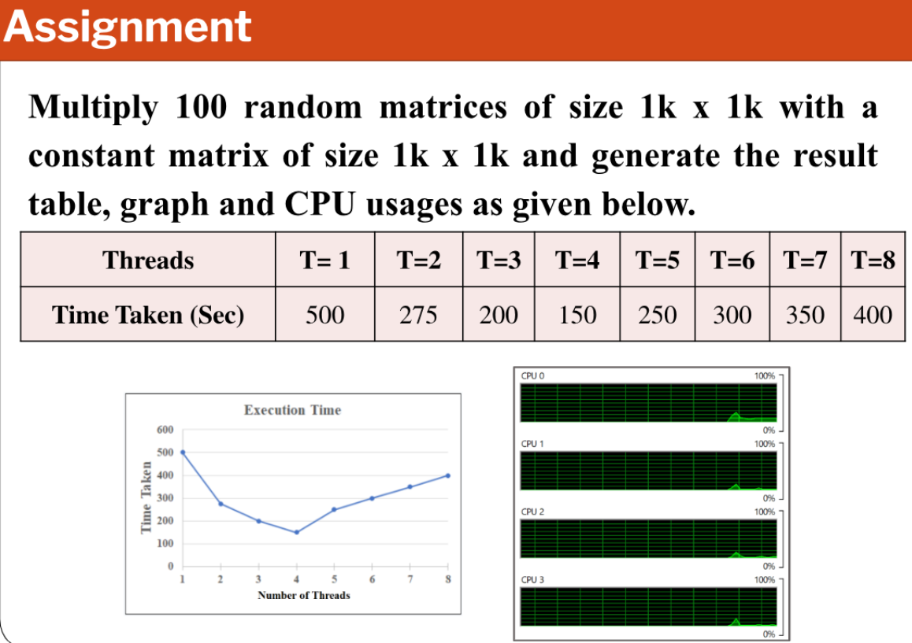

Q. Multiply 100 random matrices of size 1k X 1k with a constant matrix of size 1k X 1k and generate the result table, graph and CPU usages given below 

# Multi-Threading Matrix Multiplication

This project measures the time taken for matrix multiplication using different numbers of threads in Python. It utilizes multi-threading to parallelize the matrix multiplication process and generates a plot illustrating the relationship between the number of threads and the average time taken. Additionally, it saves the results to a CSV file for further analysis.

Output 
https://github.com/Tanisha-Sood/multithreading/blob/3ba5e252330508ce2d095dae394d1525d6c8cc7a/Graph.png
